Candidates for the strip at the top of the profile README. The root README keeps the current one until a pick is made; this folder goes away before the repo turns public.

**Current**

**Phosphor**: the current strip, made exact, with a CRT afterglow: dying cells fade, newborn cells flash warm.

**Gun**: a real Gosper glider gun fires gliders that an eater swallows further right. One source, one sink, loops exactly.

**Flotilla**: two lightweight spaceships drift left to right below a band of still lifes and wrap around.

